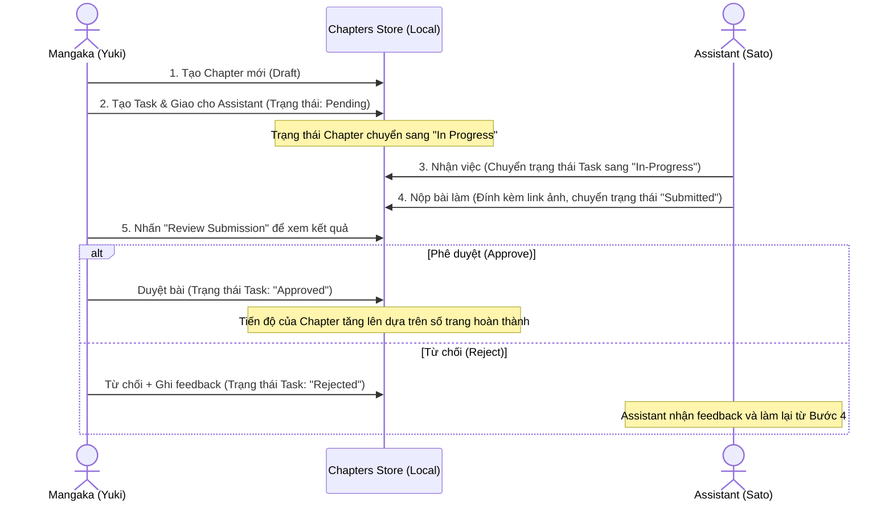

# 📋 Hướng Dẫn Tính Năng: Tạo Chapter & Quản Lý Công Việc Assistant

Tài liệu này hướng dẫn chi tiết cấu trúc, luồng xử lý, giải thích từng dòng code quan trọng và cách chạy thử nghiệm tính năng **Tạo Chapter, Giao việc cho Assistant, và Phê duyệt công việc** của Mangaka.

---

## 1. Các File Được Tạo Mới

Tính năng này được triển khai hoàn toàn bằng TypeScript và React (Next.js 15) thông qua 2 file cốt lõi:

| Đường dẫn file | Vai trò |
| :--- | :--- |
| **[`lib/chapters-store.ts`](file:///D:/VStudio/SWP392-FE/lib/chapters-store.ts)** | Store quản lý trạng thái của Chapter, Task, Assistant và Series được lưu trữ bền vững tại `localStorage`. |
| **[`app/dashboard/chapters/page.tsx`](file:///D:/VStudio/SWP392-FE/app/dashboard/chapters/page.tsx)** | Giao diện điều khiển luồng công việc (Workflow Board) tương thích động theo từng Role (Mangaka, Assistant, Editor). |

---

## 2. Luồng Hoạt Động (Workflow & File Flow)

Luồng trao đổi dữ liệu và trạng thái giữa Mangaka và Assistant diễn ra tuần tự như sau:



---

## 3. Hướng Dẫn Giải Thích Chi Tiết Code Trong `lib/chapters-store.ts`

File này chịu trách nhiệm lưu trữ và xử lý toàn bộ logic nghiệp vụ (business logic) ở phía Client.

### 3.1. Định nghĩa Kiểu Dữ Liệu (Interfaces)
```typescript
// Định nghĩa trạng thái của một Chương truyện
export type ChapterStatus = 'Draft' | 'In Progress' | 'Ready for Editor' | 'Published'

// Định nghĩa trạng thái của một Task vẽ được giao cho Assistant
export type TaskStatus = 'Unassigned' | 'Pending' | 'In-Progress' | 'Submitted' | 'Approved' | 'Rejected'

// Interface đại diện cho thông tin một Trợ lý (Assistant)
export interface Assistant {
  id: string;          // ID duy nhất (Ví dụ: A01, A02)
  name: string;        // Tên hiển thị (Ví dụ: Sato Takashi)
  avatarUrl: string;   // Ảnh đại diện
  specialty: string;   // Chuyên môn (Ví dụ: Vẽ background, Lên line art)
  activeTasks: number; // Số lượng task đang làm (được tính toán động)
}
```

### 3.2. Giải thích các Hàm Xử Lý Dữ Liệu (API Store)

#### 1. Hàm khởi tạo và tải dữ liệu từ localStorage
```typescript
function loadChapters(): Chapter[] {
  // Kiểm tra xem code có đang chạy ở phía Client (trình duyệt) hay không
  if (typeof window === 'undefined') return SEED_CHAPTERS
  try {
    const raw = localStorage.getItem(STORAGE_CHAPTERS_KEY)
    // Nếu chưa có dữ liệu trong LocalStorage, ghi dữ liệu mẫu (SEED) vào làm mặc định
    if (!raw) {
      localStorage.setItem(STORAGE_CHAPTERS_KEY, JSON.stringify(SEED_CHAPTERS))
      return SEED_CHAPTERS
    }
    // Ngược lại, parse chuỗi JSON thành mảng các đối tượng Chapter
    return JSON.parse(raw) as Chapter[]
  } catch {
    return SEED_CHAPTERS
  }
}
```

#### 2. Hàm Tạo Chapter Mới (`createChapter`)
Hàm này cho phép tạo Chapter với số chương nhập tay, nếu không nhập hoặc nhập không hợp lệ sẽ tự động tính số chương tiếp theo (sequential numbering):
```typescript
export function createChapter(data: Omit<Chapter, 'id' | 'createdAt'>): Chapter {
  const chapters = loadChapters()
  
  // Lọc ra các chapter đã có của bộ truyện (series) này
  const existingInSeries = chapters.filter(c => c.seriesId === data.seriesId)
  
  // Sử dụng số chương nhập tay nếu lớn hơn 0, ngược lại tự động tính (số chương lớn nhất hiện tại + 1)
  const finalNumber = data.number > 0 ? data.number : (
    existingInSeries.length > 0
      ? Math.max(...existingInSeries.map(c => c.number)) + 1
      : 1
  )

  const newChapter: Chapter = {
    ...data,
    id: `CH${String(chapters.length + 1).padStart(2, '0')}`, // Tạo ID tự động: CH01, CH02...
    number: finalNumber, // Gán số chương cuối cùng
    createdAt: new Date().toISOString() // Lưu mốc thời gian tạo
  }

  chapters.push(newChapter) // Đẩy vào mảng chung
  saveChapters(chapters)    // Ghi đè lại vào LocalStorage
  return newChapter
}
```

#### 3. Hàm Tạo Task & Giao việc cho Assistant (`createTask`)
```typescript
export function createTask(data: Omit<Task, 'id' | 'status' | 'assistantName'>): Task {
  const tasks = loadTasks()
  const assistants = getAssistants()
  
  // Tìm thông tin Assistant từ danh sách bằng ID truyền lên
  const assistant = assistants.find(a => a.id === data.assistantId)
  const assistantName = assistant ? assistant.name : 'Unassigned'
  
  const newTask: Task = {
    ...data,
    id: `T${String(tasks.length + 1).padStart(2, '0')}`, // Tự động sinh ID: T01, T02...
    assistantName, // Gán tên Assistant đi kèm để hiển thị nhanh trên UI
    // Nếu chưa gán cho ai thì status là Unassigned, ngược lại là Pending (Chờ nhận việc)
    status: data.assistantId === 'Unassigned' ? 'Unassigned' : 'Pending',
    assignedAt: data.assistantId === 'Unassigned' ? undefined : new Date().toISOString()
  }

  tasks.push(newTask)
  saveTasks(tasks)
  return newTask
}
```

#### 4. Hàm Phê duyệt / Từ chối bài làm của Assistant (`updateTaskStatus`)
Đây là trái tim của luồng phê duyệt, tự động xử lý tăng giảm tải công việc của trợ lý khi bài làm được duyệt:
```typescript
export function updateTaskStatus(
  taskId: string, 
  status: TaskStatus, 
  feedback?: string, 
  submittedWorkUrl?: string
): boolean {
  const tasks = loadTasks()
  const idx = tasks.findIndex(t => t.id === taskId)
  if (idx === -1) return false
  
  const oldTask = tasks[idx]
  const oldStatus = oldTask.status

  // Cập nhật các trường thông tin mới của Task
  tasks[idx] = {
    ...oldTask,
    status, // Trạng thái mới (ví dụ: 'Approved' hoặc 'Rejected')
    feedback: feedback !== undefined ? feedback : oldTask.feedback, // Phản hồi của Mangaka
    submittedWorkUrl: submittedWorkUrl !== undefined ? submittedWorkUrl : oldTask.submittedWorkUrl, // URL bài vẽ
    updatedAt: new Date().toISOString()
  }
  
  saveTasks(tasks)
  return true
}
```

---

## 4. Hướng Dẫn Giải Thích Chi Tiết Giao Diện: `app/dashboard/chapters/page.tsx`

File này chứa giao diện React và điều khiển tương tác người dùng dựa theo Role.

### 4.1. Khởi tạo State và Theo dõi Trạng thái
```typescript
export default function ChaptersPage() {
  // Lấy role hiện tại từ RoleContext chung của dự án
  const { role } = useRole()
  const [mounted, setMounted] = useState(false)
  
  // Quản lý Toast thông báo nhanh ở góc màn hình
  const [toast, setToast] = useState<{ message: string; type: 'success' | 'error' } | null>(null)

  // State quản lý danh sách Chapter và Task
  const [chapters, setChapters] = useState<Chapter[]>([])
  const [selectedChapterId, setSelectedChapterId] = useState<string>('')
  const [chapterTasks, setChapterTasks] = useState<Task[]>([])
  
  // Quản lý trạng thái đóng/mở các Modal form
  const [isChapterModalOpen, setIsChapterModalOpen] = useState(false)
  const [isTaskModalOpen, setIsTaskModalOpen] = useState(false)
```

### 4.2. Xử lý logic tạo Chapter (Mangaka)
Form đăng ký chapter mới được nâng cấp thành một biểu mẫu 5 phần toàn diện (Thông tin cơ bản, Tóm tắt nội dung, Bản thảo kịch bản, Bản thảo Sequential Art bắt buộc, Ghi chú cho Editor) cùng tính năng Điền dữ liệu mẫu (Fill Sample) và kiểm tra lỗi nghiêm ngặt:
```typescript
  // 1. Helper kiểm tra ngày xuất bản (Quy tắc BR-42)
  const validatePublicationDate = (pubDate: string, createdDate = new Date()) => {
    const pub = new Date(pubDate)
    const created = new Date(createdDate)
    const today = new Date()
    today.setHours(0, 0, 0, 0)

    // Ngày xuất bản bắt buộc phải ở tương lai
    if (pub <= today) return 'Ngày xuất bản dự kiến phải nằm trong tương lai'

    const deadline = new Date(pub)
    deadline.setDate(deadline.getDate() - 14) // Hạn nộp bản thảo là 14 ngày trước xuất bản

    const minDeadline = new Date(created)
    minDeadline.setDate(minDeadline.getDate() + 3) // Tối thiểu trợ lý/mangaka phải có 3 ngày làm việc

    // BR-42: Hạn chót nộp bản thảo phải sau ngày tạo ít nhất 3 ngày (tương đương ngày xuất bản cách ngày hiện tại ít nhất 17 ngày)
    if (deadline < minDeadline) {
      return 'Ngày xuất bản phải cách ngày hiện tại ít nhất 17 ngày (do hạn nộp bản thảo là 14 ngày trước xuất bản + tối thiểu 3 ngày làm việc)'
    }
    return null
  }

  // 2. Helper kiểm tra quyền tạo Chapter (Quy tắc BR-40)
  const canCreateChapter = (userId: string, series: Series) => {
    return series.mangakaId === userId && series.status === 'Active'
  }

  // 3. Xử lý khi nhấn nút Đăng Ký Chapter Lên Hệ Thống
  const handleCreateChapter = (e: React.FormEvent) => {
    e.preventDefault()
    const errs: Record<string, string> = {}

    if (!newChapterSeriesId) errs.seriesId = 'Vui lòng chọn tác phẩm'
    if (!newChapterNo) errs.chapterNo = 'Vui lòng nhập số chương'
    if (!newChapterTitle.trim()) errs.title = 'Vui lòng nhập tiêu đề chương'
    if (!newChapterPubDate) {
      errs.publicationDate = 'Vui lòng chọn ngày xuất bản dự kiến'
    } else {
      const dateError = validatePublicationDate(newChapterPubDate)
      if (dateError) errs.publicationDate = dateError
    }

    // Kiểm tra đính kèm bản thảo bắt buộc (Bản thảo tranh thô)
    if (newChapterManuscriptFiles.length === 0) {
      errs.manuscriptFiles = 'Tối thiểu phải đính kèm 1 file bản thảo tranh thô'
    }

    // BR-40: Kiểm tra điều kiện active và sở hữu của series
    const selectedSeries = mangakaSeries.find(s => s.id === newChapterSeriesId)
    if (selectedSeries && !canCreateChapter(MOCK_MANGAKA_ID, selectedSeries)) {
      errs.seriesId = 'Chỉ Mangaka chủ sở hữu của series đang Active mới được tạo chapter'
    }

    if (Object.keys(errs).length > 0) {
      setErrors(errs)
      showToast('Vui lòng kiểm tra lại thông tin.', 'error')
      return
    }

    // Tính toán deadline = Ngày xuất bản - 14 ngày
    const pubDateObj = new Date(newChapterPubDate)
    pubDateObj.setDate(pubDateObj.getDate() - 14)
    const deadlineString = pubDateObj.toISOString().split('T')[0]

    // Gọi API lưu vào Store kèm các trường nâng cao
    const newChap = createChapter({
      seriesId: newChapterSeriesId,
      number: parseInt(newChapterNo) || 0,
      title: newChapterTitle,
      status: 'Draft',
      totalPages: newChapterPages,
      publicationDate: newChapterPubDate,
      deadline: deadlineString,
      synopsis: newChapterSynopsis,
      notes: newChapterNotes,
      storyboardFiles: newChapterStoryboardFiles,
      manuscriptFiles: newChapterManuscriptFiles
    })

    showToast(`Đã tạo thành công Chapter ${newChap.number}: ${newChap.title}!`)
    setIsChapterModalOpen(false) // Đóng Modal form
    
    // Reset toàn bộ input form về mặc định
    setNewChapterSeriesId(selectedSeriesId)
    setNewChapterNo('')
    setNewChapterTitle('')
    setNewChapterPages(24)
    setNewChapterPubDate('')
    setNewChapterSynopsis('')
    setNewChapterNotes('')
    setNewChapterStoryboardFiles([])
    setNewChapterManuscriptFiles([])
    setErrors({})

    setSelectedChapterId(newChap.id) // Chọn luôn chương vừa tạo trên giao diện
    refreshData()                    // Tải lại dữ liệu mới nhất
  }

### 4.3. Xử lý duyệt hoặc từ chối bài vẽ (Mangaka)
```typescript
// 1. Duyệt bài (Approve)
const handleApproveTask = (task: Task) => {
  // Cập nhật trạng thái thành 'Approved' kèm lời nhắn
  updateTaskStatus(task.id, 'Approved', reviewFeedback || 'Đồng ý duyệt, bài làm rất tốt!')
  showToast(`Đã phê duyệt công việc của ${task.assistantName}!`)
  setIsReviewModalOpen(false)      // Đóng modal review
  setActiveTaskToReview(null)      // Xóa task nháp đang xem
  setReviewFeedback('')            // Xóa text ghi chú nháp
  refreshData()                    // Cập nhật giao diện (Thanh tiến độ chapter tự động tăng %)
}

// 2. Từ chối bài làm (Reject)
const handleRejectTask = (task: Task) => {
  // Bắt buộc phải nhập phản hồi lý do vì sao không đạt yêu cầu để Assistant sửa
  if (!reviewFeedback.trim()) {
    showToast('Vui lòng điền phản hồi (lý do từ chối)!', 'error')
    return
  }
  updateTaskStatus(task.id, 'Rejected', reviewFeedback)
  showToast(`Đã từ chối và gửi phản hồi yêu cầu sửa đổi!`, 'error')
  setIsReviewModalOpen(false)
  setActiveTaskToReview(null)
  setReviewFeedback('')
  refreshData()
}
```

---

## 5. Hướng Dẫn Từng Bước Chạy Thử Nghiệm (Demo Guide)

Để kiểm tra trọn vẹn luồng công việc giữa Mangaka và Assistant, bạn hãy thực hiện theo các bước sau trực tiếp trên giao diện:

### Bước 1: Tạo Chapter & Giao việc (Role: Mangaka)
1. Sử dụng **Role Switcher** ở góc dưới thanh Sidebar bên trái để chọn vai trò **`Mangaka`**.
2. Nhấp vào menu **`Tasks`** trên Sidebar để vào trang quản lý.
3. Chọn bộ truyện đang serialization (mặc định là *Sakura Knights*).
4. Nhấn nút **`Create Chapter`**:
   * Nhấp nút **`Điền Dữ Liệu Mẫu`** để tự động điền nhanh dữ liệu mẫu thực tế của Mangaka (bao gồm: Series, Chapter số 12, tiêu đề 'Sự Thức Tỉnh Của Rồng Thần', ngày xuất bản cách 30 ngày, tóm tắt, kịch bản, và bản thảo đính kèm bắt buộc).
   * Hoặc tự điền tay và nhấn vào nút **`Chọn File (Browse)`** ở mục **4. Bản thảo Sequential Art** để giả lập upload bản thảo.
   * Nhấn **Đăng Ký Chapter Lên Hệ Thống**. Chapter mới sẽ xuất hiện ở danh sách bên trái.
5. Chọn Chapter 3 vừa tạo, bạn sẽ thấy tiến độ hoàn thành là `0%` và danh sách task trống.
6. Nhấn **`Add Task`** để giao việc:
   * Chọn loại: `Coloring`
   * Số trang: `1-5`
   * Chọn Assistant: **`Sato Takashi`**
   * Nhập mô tả: *Tô màu hoàng hôn cho phân cảnh chiến đấu trên mái nhà.*
   * Nhấn **Assign Task**. Task sẽ được tạo ở trạng thái **`Pending`**.

### Bước 2: Nhận việc & Nộp sản phẩm (Role: Assistant)
1. Sử dụng **Role Switcher** để đổi sang vai trò **`Assistant`**.
2. Chọn đúng Profile Assistant là **`Sato Takashi`** tại hộp thoại lựa chọn phía trên cùng.
3. Bạn sẽ thấy ngay task *Tô màu hoàng hôn cho phân cảnh chiến đấu...* đang ở trạng thái **`Pending`**.
4. Nhấp nút **`Accept & Start`** để nhận việc. Trạng thái task chuyển sang **`In-Progress`**.
5. Nhấp nút **`Submit Finished Work`** để nộp bài:
   * Nhập link ảnh mẫu (hoặc để trống để tự động lấy ảnh hoàng hôn mặc định).
   * Nhập bình luận: *Em đã tô xong màu hoàng hôn ấm, nhờ anh duyệt giúp.*
   * Nhấn **Submit Deliverable**. Trạng thái sẽ chuyển sang **`Awaiting Mangaka Review`**.

### Bước 3: Duyệt và Phê duyệt công việc (Role: Mangaka)
1. Đổi lại vai trò thành **`Mangaka`** thông qua Sidebar.
2. Chọn Chapter 3 ở danh sách bên trái.
3. Trong danh sách task, bạn sẽ thấy task của Sato Takashi hiển thị nút **`Review Submission`**. Nhấp vào đó.
4. Một cửa sổ Modal hiện ra hiển thị hình ảnh sản phẩm vẽ kèm ghi chú của Assistant.
5. **Duyệt bài làm:** Nhập lời nhắn động viên rồi nhấn **Approve & Sign-off**. 
6. Trạng thái chuyển sang **`Approved`**. Bạn sẽ thấy thanh tiến độ của Chapter tăng lên tương ứng với số trang đã hoàn thành (`33%` cho 5 trên 15 trang).
