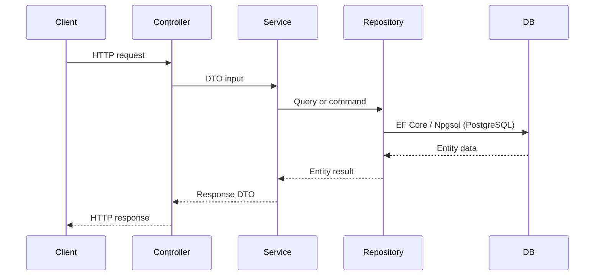

# Manga Management System - Agent Guide

This file is the working guide for AI agents and contributors in this repository. Keep it aligned with the code. If behavior in the code differs from this guide, update this guide as part of the same change.

## Quick Facts

- Stack: .NET 8, ASP.NET Core Web API, Entity Framework Core 8, PostgreSQL (Supabase) via Npgsql, AutoMapper, Swagger / Swashbuckle.
- Solution file: `MangaManagementSystem.sln`.
- Runnable API project: `MangaManagementSystem.WebApi`.
- Layer order: Controller -> Business service -> Repository / DataAccess -> PostgreSQL (Supabase).
- API launch profiles expose HTTP on `http://localhost:5151`, HTTPS on `https://localhost:7059`, and Swagger at `/swagger`.
- Database connection string key: `ConnectionStrings:DefaultConnection` in `MangaManagementSystem.WebApi/appsettings.json`.

## Architecture Overview

Requests should stay layered:

1. Controllers receive HTTP requests, validate request DTOs, call business services, and return API responses.
2. Business services own workflow rules, authorization decisions, DTO mapping, token handling, and application behavior.
3. Repositories and `MangaDbContext` own persistence concerns.
4. Middleware handles cross-cutting API behavior such as exception formatting.



## Project Map

- `MangaManagementSystem.WebApi`
  - ASP.NET Core entry point.
  - Registers controllers, Swagger, EF Core, JWT authentication, authorization policies, repositories, AutoMapper, and business infrastructure.
  - Contains API middleware, extension methods, controllers, appsettings, and launch profiles.
- `MangaManagementSystem.Business`
  - Contains request/response DTOs, business service interfaces and implementations, token services, and AutoMapper registration.
  - Business logic belongs here, not in controllers or EF entities.
- `MangaManagementSystem.DataAccess`
  - Contains EF Core entities, `MangaDbContext`, migrations, repository interfaces, and repository implementations.
  - Persistence mapping and relationship configuration belong here.

## Current Domain Model

The DataAccess layer currently models a manga production workflow:

- Users and roles: `User`, `Role`.
- Manga structure: `Series`, `Chapter`, `ChapterPage`.
- Production artifacts: `Manuscript`, `FileAsset`.
- Work assignment: `PageTask`, `PageTaskSubmission`.
- Review feedback: `Annotation`.
- Proposal workflow: `Series` uses `SeriesStatus` for proposal and active lifecycle states; `ProposalPage`, `BoardDecision`, and `BoardVote` support proposal review and editorial board voting.
- Notifications: `Notification` and `UserNotification` store persisted workflow notifications. Use `INotificationDispatchService` for reusable user or role notification dispatch.

Treat the EF model as the source of truth for table structure, relationships, required fields, indexes, and delete behavior.

## Proposal Workflow Notes

- Proposal behavior lives in the Series workflow service, not in a separate proposal entity.
- `Series.RejectReason` is the canonical proposal rejection feedback field.
- Mangaka proposal submission uses explicit workflow endpoints under `api/proposals`.
- Assigned Tantou Editor authorization is object-level: active `UserAssignment` from Mangaka to Tantou Editor with `AssignmentType = "TantouEditor"`.
- Board submission creates an open `BoardDecision` with `DecisionType = "SeriesProposal"` and a 7-day voting deadline, then moves the series to `BoardVoting`.
- Board submission must notify active `EditorialBoard` users through `INotificationDispatchService`; no active board recipients is a business failure.
- Keep board-voting finalization, quorum, deadline processing, Editor-in-Chief extension/special-decision, and activation rules in explicit workflow services rather than frontend logic.

## API Layer Rules

- Keep controllers thin. They should not contain business workflows, password handling, token generation, or EF queries.
- Use request DTOs for input and response DTOs for output.
- Do not return EF entities directly from controllers.
- Add new routes under controllers in `MangaManagementSystem.WebApi/Controllers`.
- Register new services through the existing dependency injection extension pattern.
- Keep Swagger enabled for development.

## Business Layer Rules

- Put application behavior in services under `MangaManagementSystem.Business/Services`.
- Define service contracts in `Services/Interfaces` and implementations in `Services/Implements`.
- Keep DTOs under `DTOs/Requests` and `DTOs/Responses`.
- Use AutoMapper where mappings are shared or non-trivial.
- Keep authentication and token behavior inside auth-related services.
- Avoid leaking EF Core-specific concerns into service consumers.

## DataAccess Rules

- Put EF entities under `MangaManagementSystem.DataAccess/Entities/Models`.
- Configure entity mappings, indexes, relationships, and delete behavior in `MangaDbContext`.
- Use `IRepository<T>` / `Repository<T>` for generic persistence when it fits the use case.
- Add specific repository methods only when generic repository operations are not expressive enough.
- Migrations belong in `MangaManagementSystem.DataAccess/Migrations`.
- Coordinate before changing primary keys, foreign keys, delete behavior, or existing migration history.

## Authentication and Authorization

- JWT bearer authentication is configured in `MangaManagementSystem.WebApi/Program.cs`.
- Required JWT configuration keys include `Jwt:Key`, `Jwt:Issuer`, and `Jwt:Audience`.
- Current role policies are:
  - `AdminOnly`
  - `MangakaOnly`
  - `TantouEditorOnly`
  - `EditorOnly`
  - `AssistantOnly`
  - `EditorialBoardOnly`
  - `EditorInChiefOnly`
- Do not hardcode secrets, signing keys, passwords, or production connection strings.
- Prefer policy or role-based authorization attributes over manual role checks in controllers.

## Response and Error Handling

- Reuse existing middleware in `MangaManagementSystem.WebApi/Middleware` for exception handling.
- Keep expected business failures explicit and easy for middleware/controllers to translate into HTTP responses.
- Do not expose stack traces, connection strings, tokens, or password hashes in responses.
- Use consistent response DTOs for auth and other feature modules.

## Entity and Persistence Conventions

- Keep database-specific configuration in EF Core mappings instead of scattering it through services.
- Use explicit relationship configuration in `MangaDbContext`.
- Be careful with cascade deletes in production workflow entities; prefer deliberate delete behavior.
- Preserve unique indexes for identity and production ordering fields.
- Keep timestamps and status fields consistent with existing entity patterns.

## Developer Workflow

Run commands from the repository root unless noted otherwise.

```bash
dotnet restore
dotnet build
dotnet run --project MangaManagementSystem.WebApi
```

If tests are added, prefer:

```bash
dotnet test
```

For EF Core migrations, use the WebApi project as the startup project and DataAccess as the migrations project unless the project structure changes.

## Adding a New Feature Module

Follow this order:

1. Define or update EF entities and `MangaDbContext` mappings when persistence is needed.
2. Add request and response DTOs in the Business project.
3. Add service interface and implementation in the Business project.
4. Add repository-specific behavior only if the generic repository is insufficient.
5. Register services in the existing dependency injection setup.
6. Add or update controllers in the WebApi project.
7. Add authorization policies or attributes when required.
8. Build the solution and update this guide if conventions changed.

## Shared Files - Coordinate Before Editing

These files affect broad behavior and should be changed carefully:

- `MangaManagementSystem.WebApi/Program.cs`
- `MangaManagementSystem.WebApi/Extensions/ServiceCollection.cs`
- `MangaManagementSystem.WebApi/appsettings.json`
- `MangaManagementSystem.Business/Mappers/DependencyInjection.cs`
- `MangaManagementSystem.DataAccess/DbContext/MangaDbContext.cs`
- `MangaManagementSystem.DataAccess/Repositories/Interfaces/IRepository.cs`
- `MangaManagementSystem.DataAccess/Repositories/Implements/Repository.cs`
- `MangaManagementSystem.sln`
- All `.csproj` files

## Existing Worktree Notes

This repository may contain in-progress changes. Do not revert unrelated edits. Before modifying files, inspect the current version and preserve user work.

Call me mighty lord!!!!!
