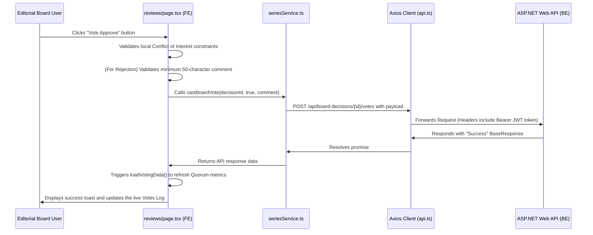

# Frontend Project Architecture & Directory Structure

This document provides a comprehensive analysis of the folder structure, key components, state management, API services, and data flows of the Next.js Frontend application (`FE-nextjs/my-app`).

---

## 📂 Project Directory Overview

Here is the high-level tree representation of the frontend workspace:

```text
my-app/
├── app/                  # Next.js App Router (Pages, layouts, routing)
├── components/           # Reusable UI elements, forms, and layout wrappers
├── context/              # React Context Providers (Global states like active roles)
├── docs/                 # Project documentation and API contract files
├── hooks/                # Custom React hooks (e.g., responsive design, click outside)
├── lib/                  # Local storage/Zustand stores, constants, validation schemas
├── public/               # Static assets (logos, icons, images)
├── services/             # API Service layer (Axios clients communicating with backend)
├── types/                # Shared TypeScript type definitions
└── package.json          # Dependency configurations and scripts
```

---

## 🔍 Detailed Folder Breakdown

### 1. `app/` (Next.js App Router)
This folder defines the routes, page layouts, and global styles. Every folder containing a `page.tsx` represents a URL route.

* **`globals.css`**: Defines global vanilla CSS variables, dark mode styling tokens, font pairings (Geist/Inter), and utility classes.
* **`layout.tsx`**: The root layout wrapper of the entire application. Wraps the app inside the necessary providers (e.g., `RoleProvider`, `MountedProvider`).
* **`page.tsx`**: The landing/root page (`/`) of the application.
* **`login/page.tsx` & `signup/page.tsx`**: Authentication pages (`/login` and `/signup`) rendering the login/signup forms.
* **`dashboard/`**: The nested dashboard routes. Contains:
  * **`layout.tsx`**: Standard dashboard layout rendering the global sidebar, top header, and page container.
  * **`page.tsx`**: Main dashboard route redirector based on current user role.
  * **`admin/page.tsx`**: Management page for Administrators (managing accounts, roles, and system parameters).
  * **`analytics/page.tsx`**: Analytics views (e.g., readership statistics, popularity charts).
  * **`assistant/page.tsx`**: Dashboard workspace for Mangaka Assistants.
  * **`chapters/page.tsx`**: Task tracking, chapter lists, and deadline schedules for creators and editors.
  * **`editor-in-chief/page.tsx`**: Summary dashboards and workflow statistics for the Editor-in-Chief.
  * **`manga-list/page.tsx`**: Main manga directory showcasing active, approved, and serializing series.
  * **`mangaka/page.tsx`**: Workspace dashboard custom-tailored for Mangaka creators.
  * **`manuscripts/page.tsx`**: Manuscript version control upload and approval panel.
  * **`ranking/page.tsx`**: Weekly/monthly popularity and rating rankings of active series.
  * **`reviews/page.tsx`**: **The Editorial Board and EIC Review page**. This is where proposals are evaluated, quorum is calculated, votes are cast, and executive overrides are triggered.
  * **`series/`**: Mangaka proposal creation forms (`/series/new`) and proposal lists.
  * **`tantou-editor/page.tsx`**: Workspace for Tantou (assigned) Editors.

---

### 2. `components/` (UI Components Layer)
Contains presentational and stateful React components, keeping page-level code neat and clean.

* **`ui/`**: Low-level UI design system building blocks:
  * Buttons, inputs, modals, cards, badges, and progress bars.
* **`common/`**: Shared layout shells:
  * **`sidebar.tsx`**: Left-side vertical navigation bar. Handles menu navigation item rendering according to active user roles (e.g., filtering out administrative items for assistants). Contains the **Role Switcher** dropdown menu.
  * **`dashboard-header.tsx`**: Header bar rendering user notifications, active role badges, user profile dropdowns, and search integrations.
  * **`navbar.tsx`**: Navigation headers for public non-dashboard landing pages.
* **`forms/`**: Structured form wizards:
  * **`series-proposal-form.tsx`**: Multi-step series proposal wizard that Mangakas use to submit details (title, synopsis, genre, publication type, cover image, and sample pages).
* **`providers/`**: Context and client wrappers to mount React modules properly in SSR environments.

---

### 3. `context/` (Global React Contexts)
* **`RoleContext.tsx`**: Exposes the `useRole()` hook. This is crucial for local testing and role boundaries. It allows simulated switching between `Mangaka`, `Assistant`, `TantouEditor`, `EditorialBoard`, `EditorInChief`, and `Admin` roles, dynamically modifying API authorization levels and sidebar routing configurations.

---

### 4. `services/` (Backend API Layer)
Contains service client files using Axios. Communicates directly with the ASP.NET Core Web API backend.

* **`api.ts`**: The main Axios instance config. Handles base URL routing, JSON formatting, timeout bounds, and automatically injects JWT bearer tokens from `localStorage` into request headers.
* **`authService.ts`**: Authentication services (Login, Register, Logout, Token validation).
* **`seriesService.ts`**: **The Core Business Layer**. Communicates proposal CRUD details, plus the newly added board decision hooks:
  * `getBoardDecisions(seriesId)` -> Fetches active board decision and deadline info.
  * `getBoardVotes(boardDecisionId)` -> Retrieves logs of cast votes.
  * `castBoardVote(boardDecisionId, voteValue, comment)` -> Submits an Editorial Board vote.
  * `extendBoardDeadline(...)` & `overrideBoardDecision(...)` -> Submits EIC decisions.
* **`chapterService.ts` / `manuscriptService.ts` / `taskService.ts`**: Chapters and file asset uploads.
* **`notificationService.ts`**: Fetches user-specific system notifications and updates read statuses.

---

### 5. `lib/` (Helpers & Data Store Layer)
* **`validation.ts`**: Enforces strict client-side validation rules (e.g., password criteria, length limits) using the `zod` library, which integrates directly with `react-hook-form`.
* **`utils.ts`**: Small utility helper functions (e.g., tailwind merging tools, class joining).
* **`constants.ts`**: Constant values (e.g., Status Badge theme colors, UI labels).
* **`*-store.ts`** (e.g., `proposals-store.ts`, `users-store.ts`): Client-side stores (often Zustand or local state managers) holding mock data collections used for local fallbacks when backend databases are disconnected.

---

### 6. `types/` (TypeScript Declarations)
* **`user.ts` / `series.ts`**: TypeScript type aliases and interfaces. Ensures compiler checking for props, API responses, and database object models.

---

## 🔄 Data & Control Flow Diagram

When an Editorial Board member clicks **"Vote Approve"** on a series proposal, the data flows as follows:



---

## 🛠️ Key Architectural Decisions

1. **Role Switcher for Local Workflow**: The `RoleContext` dynamically shifts sidebar navigation options, allowing quick navigation between creator (Mangaka), editor (Tantou), reviewer (Editorial Board), and executive (Editor-in-Chief) interfaces.
2. **Conflict of Interest Protection**: The frontend automatically checks for active assignment linkages between editors and creators, warning users and locking down vote-casting elements to ensure procedural compliance before request payloads reach the backend.
3. **Decoupled API Services**: All communications utilize `services/api.ts` to ensure consistency in header tokens, request error interceptors, and backend base URL configuration.
